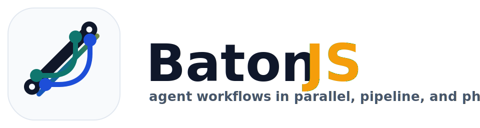

<p align="center">
  
</p>
<!-- Lightweight TypeScript workflow engine that turns JS/TS scripts into AI agent pipelines with pluggable Claude, CodeBuddy, Codex, and Reasonix SDK backends. -->

# BatonJS

[](https://www.npmjs.com/package/batonjs)
[](https://opensource.org/licenses/MIT)
[](https://nodejs.org/)
[](https://www.typescriptlang.org/)

BatonJS lets you write multi-agent AI workflows as plain async JavaScript scripts, with simple globals like `agent()`, `parallel()`, and `pipeline()` that handle concurrency, budgeting, retries, and structured output validation automatically. It's SDK-agnostic out of the box, supporting Anthropic Claude, Tencent CodeBuddy, OpenAI Codex, and Reasonix through pluggable adapters — swap backends without rewriting your workflows. Whether you're running a one-off automation or a production pipeline, BatonJS gives you deterministic control flow with the ergonomics of a script and the reliability of an engine.

---

## Why BatonJS?

Building multi-agent AI workflows shouldn't mean wrestling with orchestration boilerplate. BatonJS gives you **plain async JavaScript/TypeScript** with a small set of script globals — the engine handles the rest.

- ✅ **SDK-agnostic adapters** — Pluggable adapters for Anthropic Claude, Tencent CodeBuddy, OpenAI Codex, and Reasonix. Swap providers without rewriting workflow logic; verify by checking `src/adapters/` for each concrete implementation.

- ✅ **Six script globals, zero boilerplate** — `agent()`, `parallel()`, `pipeline()`, `phase()`, `log()`, and `budget` are all you need. Write standard `async`/`await` code; no class inheritance, decorators, or DSL to learn.

- ✅ **Automatic concurrency & throttling** — The engine caps concurrent agent calls at `min(16, cpuCores − 2)` and queues the rest. You call `parallel([...])` with 100 items and it runs correctly without manual semaphore management.

- ✅ **Built-in budget tracking** — Pass a token budget (e.g. `+500k`), and every `agent()` call deducts from the shared pool. The loop exits automatically when `budget.remaining()` hits zero — no overspend, no manual accounting.

- ✅ **Retry with exponential backoff** — Transient API failures are retried transparently. Configure per-adapter retry counts and backoff multipliers in your adapter config; the engine handles sleep-and-retry internally.

- ✅ **Structured output enforcement** — Pass a JSON Schema to `agent()` and the engine validates the response at the tool-call layer, retrying on mismatch. You get typed results without writing your own parsing or validation code.

- ✅ **Nested sub-workflows** — Call `workflow(nameOrRef, args)` inside a running workflow to compose multi-phase pipelines. Child workflows share the parent's concurrency cap, abort signal, and budget — no context leakage.

- ✅ **Timeout & abort signals** — Every agent call respects a configurable timeout; a parent abort propagates to all in-flight children. Verify by setting a short timeout and observing clean cancellation in logs.

BatonJS is for developers who want **programmatic control** over multi-agent pipelines — not a heavy framework, not a visual DAG editor, just a minimal engine that makes concurrent AI calls correct and composable.

---

## Quick Start

**Prerequisites:** Node.js ≥ 18

Install:

```bash
npm install batonjs
```

Or run directly without installing:

```bash
npx -y batonjs ./workflow.js
```

Write a workflow script:

```js
// workflow.js
export const meta = {
  name: 'my-first-workflow',
  phases: [{ title: 'Analyze' }, { title: 'Summarize' }],
}

// Phase 1: Run two agents in parallel
phase('Analyze')
const [security, perf] = await parallel([
  () => agent('Check this code for security issues', { label: 'security' }),
  () => agent('Check this code for performance bottlenecks', { label: 'perf' }),
])

// Phase 2: Summarize findings
phase('Summarize')
const summary = await agent(
  `Summarize these findings:\n${JSON.stringify({ security, perf })}`,
  { label: 'summarize' },
)

log('Done!')
return { summary }
```

Run it:

```bash
batonjs ./workflow.js
```

Switch to a different SDK backend:

```bash
batonjs --sdk codex ./workflow.js
batonjs --sdk codebuddy ./workflow.js
batonjs --sdk reasonix ./workflow.js
```

---

## CLI Reference

```
batonjs [options] <script>
```

| Flag | Description | Default |
|------|-------------|---------|
| `--args <json>` | Pass arguments into the script as the `args` global | — |
| `--budget <usd>` | Max spend in USD | unlimited |
| `--concurrency <n>` | Max concurrent agents | 2 |
| `--cwd <dir>` | Working directory for agents | `.` |
| `--sdk <name>` | `anthropic`, `codebuddy`, `codex`, or `reasonix` | `anthropic` |
| `--timeout <minutes>` | Per-agent timeout in minutes | 5 |
| `-h, --help` | Show help | — |

---

## Script API

Workflow scripts receive these injected globals:

| Global | Description |
|--------|-------------|
| `agent(prompt, opts?)` | Run an AI agent. Returns the result or `null` on failure |
| `parallel(thunks)` | Run an array of async thunks concurrently; waits for all |
| `pipeline(items, ...stages)` | Stream each item through stages independently |
| `phase(title)` | Mark the current phase (for progress display) |
| `log(message)` | Emit a log message |
| `budget` | `{ total, spent(), remaining() }` — real-time budget info |
| `args` | Custom arguments passed via `--args` |
| `workflow(ref, args?)` | Run a nested sub-workflow (one level max) |

### `agent(prompt, opts?)`

```js
// Free-text response
const result = await agent('Explain this error')

// Structured output with JSON Schema
const issues = await agent('Find bugs in this code', {
  schema: {
    type: 'object',
    properties: { bugs: { type: 'array', items: { type: 'string' } } },
    required: ['bugs'],
  },
})
// issues.bugs — validated array of strings
```

Options:

| Option | Description |
|--------|-------------|
| `label` | Display name for progress output |
| `phase` | Assign to a phase group |
| `schema` | JSON Schema for structured output |
| `model` | Override model for this agent |

---

## Examples

The [`examples/`](./examples/) directory contains 31 ready-to-run workflows, organized by level:

| # | Pattern | Description |
|---|---------|-------------|
| 01 | `agent()` | Hello World — one agent, one result |
| 06 | `schema` | Structured output with JSON Schema validation |
| 07–08 | `parallel` / `pipeline` | Concurrency primitives |
| 09 | `pipeline` vs `parallel` | When to use which |
| 11 | Multi-stage `pipeline` | Chain stages per item |
| 12 | Loop-until-dry | Keep discovering until exhausted |
| 13 | Loop-until-budget | Scale depth to budget |
| 15 | Adversarial verify | N skeptics try to refute a claim |
| 16 | Judge panel | Diverse approaches scored and synthesized |
| 21 | Code review | Multi-dimension review with verification |
| 31 | README generator | Five-dimension README generation |

Run any example:

```bash
batonjs ./examples/01-hello-world.js
batonjs --sdk codex ./examples/06-structured-output.js
batonjs --budget 2.0 ./examples/21-code-review.js
```

---

## Programmatic API

```ts
import { Engine } from 'batonjs'

const engine = new Engine({
  scriptPath: './workflow.js',
  sdk: 'anthropic',       // or 'codebuddy', 'codex', or 'reasonix'
  maxBudgetUsd: 2.0,
  maxConcurrency: 5,
})

engine.on((event) => {
  if (event.kind === 'log') console.log(event.message)
})

const result = await engine.run()

if (result.ok) {
  console.log('Result:', result.value.result)
  console.log('Cost: $' + result.value.totalCostUsd.toFixed(4))
}
```

---

## API Reference

BatonJS exposes a compact public surface — engine, result helpers, SDK adapters, and a rich set of types. Everything below is re-exported from the [entry point](src/index.ts).

### Engine

The workflow runtime that loads a script, injects globals, and orchestrates execution.

| Export | Description |
|--------|-------------|
| **`Engine`** | Load a script and run it inside a sandboxed workflow environment. |
| **`EngineOptions`** | Configuration for `new Engine()`: `scriptPath`, `args`, `maxBudgetUsd`, `maxConcurrency`, `cwd`, `permissionMode`, `sdk`, `agentTimeoutMs`, `signal`. |
| **`EngineRunResult`** | Return type of `engine.run()` — always a `Result<EngineResult, Error>`. |
| **`EngineResult`** | Successful run payload: `{ success, result, totalCostUsd, durationMs, meta }`. |

```ts
import { Engine } from "batonjs";
const engine = new Engine({ scriptPath: "./my-workflow.ts", maxBudgetUsd: 5.0 });
const outcome = await engine.run(); // Result<EngineResult, Error>
```

→ [Quick Start](#quick-start) · [Events](#events)

### Result Helpers

Predictable, allocation-friendly error handling without `try/catch`.

| Export | Description |
|--------|-------------|
| **`ok`** | Create a successful `Result<T, E>` value. |
| **`err`** | Create a failed `Result<T, E>` error. |
| **`Result`** | Discriminated union: `{ ok: true; value: T } \| { ok: false; error: E }`. |

```ts
import { ok, err } from "batonjs";
const found = ok(42);          // Result<number, never>
const failed = err("missing"); // Result<never, string>
```

→ [TypeScript Philosophy](CLAUDE.md)

### SDK Adapters

Pluggable backends that translate BatonJS calls into provider-specific SDK operations.

| Export | Description |
|--------|-------------|
| **`createSdkProvider`** | Factory — returns an `SdkProvider` for a given backend name. |
| **`SdkName`** | Union: `'anthropic' \| 'codebuddy' \| 'codex' \| 'reasonix'`. |
| **`SdkProvider`** | Contract: `{ query(options): SdkQueryHandle }`. |
| **`SdkQueryOptions`** | Options for a query call: `permissionMode`, `abortController`, `outputFormat`, `model`, `cwd`, `maxBudgetUsd`, `effort`. |
| **`SdkQueryHandle`** | Async-iterable handle with `interrupt()` and `return()` cleanup. |
| **`SdkResultMessage`** | Normalised result message, discriminated on `subtype`: `'success'` vs error variants. |
| **`EffortLevel`** | Unified reasoning effort: `'medium' \| 'high' \| 'xhigh'`. |

```ts
import { createSdkProvider } from "batonjs";
const sdk = createSdkProvider("anthropic");
const handle = sdk.query({ model: "claude-sonnet-4-20250514", permissionMode: "auto" });
```

→ [SDK Adapters source](src/core/sdk.ts)

### Events

Synchronous, type-safe event bus for observing engine lifecycle.

| Export | Description |
|--------|-------------|
| **`EngineEventBus`** | Create a bus, register handlers, and emit typed events. |
| **`EngineEvent`** | Discriminated union of all lifecycle events (`workflow_start`, `workflow_end`, `phase`, `log`, `agent_start`, `agent_end`, `agent_error`, `budget_update`, …). |
| **`EngineEventHandler`** | Handler signature: `(event: EngineEvent) => void`. |

```ts
import { EngineEventBus } from "batonjs";
const bus = new EngineEventBus();
bus.on("agent_start", (e) => console.log(`→ ${e.label}`));
```

→ [Engine Events types](src/types.ts)

### Script Globals

The runtime contract injected into every workflow script.

| Export | Description |
|--------|-------------|
| **`ScriptGlobals`** | Full set: `agent`, `parallel`, `pipeline`, `phase`, `log`, `budget`, `args`, `workflow`. |
| **`ScriptMeta`** | Shape of `export const meta = { name, description, phases }`. |
| **`AgentOpts`** | Options for `agent()`: `label`, `phase`, `schema`, `model`, `maxRetries`, `effort`. |
| **`BudgetHandle`** | Script-facing budget: `{ total, spent(), remaining() }`. |
| **`WorkflowRef`** | Reference to another workflow: `string` or `{ scriptPath }`. |

```ts
// Inside a workflow script — globals are injected by the Engine
const result = await agent("Summarise the article", { schema: SummarySchema });
const all = await parallel([() => agent("A"), () => agent("B")]);
```

→ [Script Globals types](src/types.ts) · [Examples](examples/)

### Concurrency & Budget

Utilities for controlling parallelism and spending.

| Export | Description |
|--------|-------------|
| **`Semaphore`** | Counting semaphore — `acquire()` / `release()` to cap concurrency. |
| **`BudgetTracker`** | Track cumulative USD spend — `record()`, `tryAcquire()`, `adjust()`. |

```ts
import { Semaphore, BudgetTracker } from "batonjs";
const sem = new Semaphore(4);
const budget = new BudgetTracker(10.0); // $10 USD cap
```

---

## SDK Backends

| Backend | `--sdk` value | Package |
|---------|--------------|---------|
| Anthropic Claude | `anthropic` (default) | `@anthropic-ai/claude-agent-sdk` |
| Tencent CodeBuddy | `codebuddy` | `@tencent-ai/agent-sdk` |
| OpenAI Codex | `codex` | `@openai/codex-sdk` |
| Reasonix | `reasonix` | CLI binary (`reasonix run`) |

---

## Documentation & Resources

### Guides

- **[Getting Started](#quick-start)** — Installation, quick start, and basic usage of the BatonJS workflow engine
- **[Workflow Tutorial](workflow-tutorial/)** — Step-by-step tutorial for AI assistants to learn BatonJS concepts, API patterns, and best practices (6 chapters)
- **[Examples](examples/)** — 31 workflow examples from hello-world to full quality gate, covering pipeline, parallel, adversarial verify, judge panel, and more

### API Reference

- **[API Entry Point](src/index.ts)** — Public API: Engine class, Result type, SDK provider, event bus, concurrency primitives, budget tracker
- **[CLI Reference](src/cli.ts)** — Command-line interface options: --args, --budget, --concurrency, --cwd, --sdk, --timeout
- **[Script Globals](src/types.ts)** — Workflow script globals: agent(), parallel(), pipeline(), phase(), log(), budget, args, workflow()
- **[Engine Events](src/types.ts)** — Discriminated union event types emitted during workflow execution for observability
- **[SDK Adapters](src/core/sdk.ts)** — Pluggable SDK backends: Anthropic Claude Agent SDK, Tencent Codebuddy Agent SDK, OpenAI Codex SDK, Reasonix

### Development

- **[TypeScript Philosophy](CLAUDE.md)** — Project coding conventions: zero any, discriminated unions, Result pattern, never exhaustiveness checks
- **[Contributing](package.json)** — Development commands (dev, build, test, lint, check) and project setup with husky + lint-staged

### Project

- **[Changelog](CHANGELOG.md)** — Release history and version changes
- **[GitHub Repository](https://github.com/unfallenwill/batonjs)** — Source code, issues, and pull requests

---

## Contributing

Contributions are welcome! To get started:

- **Bug reports** — Open an [issue](../../issues) with a minimal reproduction.
- **Feature requests** — Open an [issue](../../issues) with a clear use case.
- **Pull requests** — Fork the repo, create a branch, and submit a PR. Please ensure `npm run check` passes before submitting.

---

## License

This project is licensed under the [MIT](LICENSE) license.
